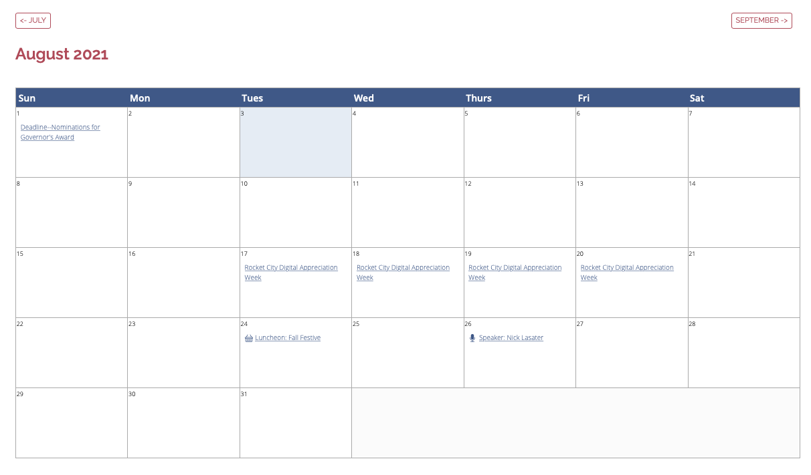

# MODX Simple Events Calendar
Simple Steps to create an Events Calendar in MODX with dedicated Event Pages

1. Create a Template called 'Event' so we can assign Template Variables to it.
2. Create a Template Variable 'start_date' that has the 'Date' Input Type
3. Create a Template Variable 'end_date' that has the 'Date' Input Type
4. Create a Resource for the Calendar. It will also be the parent for the 'Event' Children resources
5. Call the snippet `[[!Calendar]]` in that resource.
6. Add 'Event' Children 

## Some CSS for the Calendar but the majority is using Bootstrap

```
<style>
  caption{font-size: 22pt; margin: 10px 0 20px 0; font-weight: 700;}
  table.calendar{width:100%; border:1px solid #aaa;}
  td.day{width: 14%; height: 140px; border: 1px solid #aaa; vertical-align: top;}
  td.day span.day-date{font-size: 14pt; font-weight: 700;}
  th.header{background-color: #002856; color: #fff; font-size: 14pt; padding: 5px;}
  .not-month{background-color: #f2f2f2;}
  td.today {background-color:#efefef;}
  td.day span.today-date{font-size: 16pt;}
</style>
```

---

The snippet will return 2 buttons for Previous and Next Months, then a H2 heading for the Current month, then a calendar.

> I recommend you set events to expire or delete them because the snippet will get ALL children, as is. 


